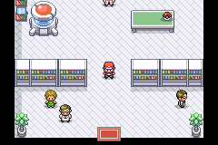
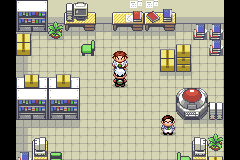

# Campanhas por controle: validação iniciada, não concluída

**As duas campanhas completas ainda não estão validadas.** A candidata é
`407bd93bf4ee7e01878cdf3186a2a3a5b3d15f6954c8de6dcce942599ef9f3d9`.
Esta etapa testa o início de cada campanha com entradas de controle desde a
tela inicial, sem escrever RAM, entrar diretamente em scripts, teleportar,
conceder Pokémon/insígnias, desativar selvagens ou aumentar atributos.

| Início | Trecho percorrido | Combate normal | Ginásios / finais |
|---|---|---|---|
| Kanto / Pallet | Seleção de Kanto na tela inicial, Novo Jogo, cidade, caminhão, quarto, mãe, Oak, escolha de Squirtle | Vitória contra o rival no laboratório | 0 ginásios, nenhum Hall of Fame |
| Hoenn / Littleroot | Novo Jogo, cidade, caminhão, chegada, quarto, relógio, mãe, TV, casa do rival, Rota 101, bolsa de Birch e laboratório | Vitória no resgate de Birch | 0 ginásios, nenhum Hall of Fame |





A escolha de Kanto usa Select na tela de título, como implementado no jogo.
O controlador confirma o relógio de Hoenn escolhendo Yes (a seleção inicial
é No), termina as telas de nome e usa o primeiro ataque nas batalhas. Os
valores de insígnias, tamanho da equipe e resultados vêm de leituras da RAM;
o controlador não escreve esses valores. O jogo permanece com os atributos,
PP, dano, experiência e cura próprios.

## Trabalho restante para validar as campanhas completas

É obrigatório percorrer os ginásios e todas as missões regionais, incluindo
os resgates/entregas originais, Celadon, incursões em Kanto, Silph, cassino de
Mauville, Shelly, Mt. Chimney, Magma Hideout, Matt, Centro Espacial, aliança de
Giovanni e crise de Rayquaza. A validação deve conquistar as 16 insígnias e
chegar aos dois Hall of Fame, começando separadamente em cada região,
verificando salvar/Continue e viagens entre regiões ao longo do percurso.

Os testes antigos com flags preparadas e atributos aumentados continuam
úteis como regressões, mas **não substituem esse percurso**. O resultado
`full_campaign_playthrough` continua `false`. Esta etapa não valida dificuldade,
as rotas posteriores, consumo de itens, puzzles posteriores ou pós-jogo.

## Reprodução e registros

```bash
python3 tools/hoenn/validate_campaign_playthrough.py \
  --source .local/hoenn-rusturf-reunion-src --library .local/mgba-bridge.so \
  --region kanto --output /tmp/campaign-kanto
python3 tools/hoenn/validate_campaign_playthrough.py \
  --source .local/hoenn-rusturf-reunion-src --library .local/mgba-bridge.so \
  --region hoenn --output /tmp/campaign-hoenn
```

Os [registros](campaign-playthrough) incluem cada comando e quantidade de
frames, checkpoints, insígnias, equipe, resultados de batalha, SHA-256 da ROM
e do controlador. São reproduzíveis desde Novo Jogo; ainda não são saves de
campanhas avançadas. O erro de uma execução deve ser investigado antes de
usar seu resultado: a automação não é uma conclusão automática sobre um bug
do jogo. O player não foi atualizado.

As [imagens das novas rotas](SEA-MAP-GALLERY.md) cobrem 25 mapas marítimos ativos
em Kanto, Hoenn e Sevii e mostram o terreno existente para revisão visual.
