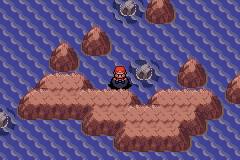
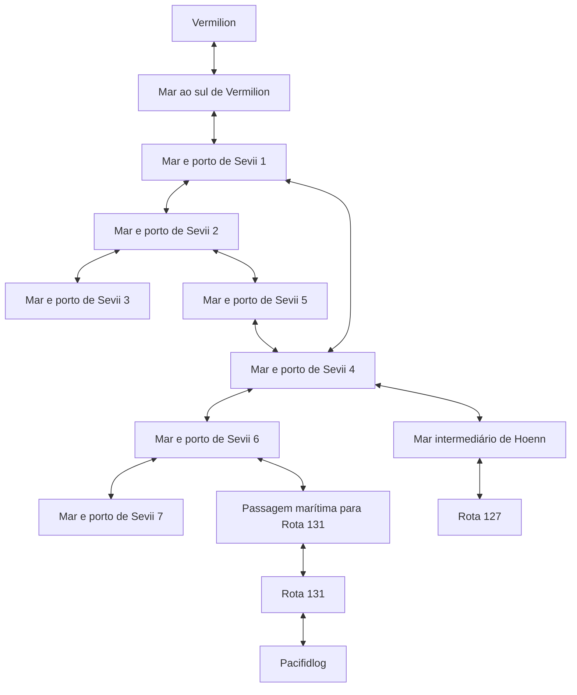
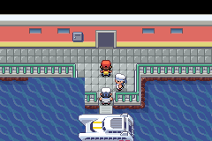
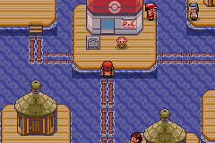

# Viagem contínua entre Kanto, Sevii e Hoenn

A validação usa controles nativos em mGBA para partir de Vermilion,
desembarcar nos portos de Sevii 1–7, visitar Pacifidlog pela Rota 131,
atravessar o mar da Rota 127 e voltar ao ponto inicial de Vermilion.
Os deslocamentos entre esses pontos usam Surf e conexões físicas dos mapas.

Passaram **24 mapas, 42 travessias de borda, 1.752 mudanças de posição,
19 ativações de Surf, seis batalhas e oito Continues**, mantendo zero
insígnias em ambas as regiões e as capturas especiais bloqueadas.

## Correção da Rota 131

O percurso original chegou a Pacifidlog, mas a volta revelou rochas no canal.
`Route131_OnTransition` seleciona `LAYOUT_ROUTE131_SKY_PILLAR`, enquanto o
canal anterior havia sido aberto somente no layout base. Uma entrada por
conexão podia mostrar o canal aberto; ao recarregar o mapa, ele fechava.
A nova camada `route131-sea-access`, aplicada depois de `special-ball`, copia
os tiles do canal base para a mesma área do layout alternativo: **37 tiles**
alterados dentro de x=48–59, y=33–39. Todos os eventos, conexões, scripts e a
entrada de Sky Pillar ficam preservados.



## Percurso



Este esquema mostra as ligações percorridas, não todas as rotas do mundo.
O roteiro usa a passagem de Surf na margem leste de Vermilion, em x=33–34.
O cais central mantém o evento original de ingresso do S.S. Anne; o primeiro
ensaio do planejador tentava esse caminho e repetia a recusa do ingresso.
Os pontos intermediários agora levam à margem correta, sem alterar o navio
ou conceder seu ingresso por fixture.





## Persistência e regressões

Os Continues foram feitos no mar de Vermilion, portos de Sevii 3 e 4,
passagem para Pacifidlog, Rota 131 com layout alternativo, Pacifidlog,
Rota 127 e Vermilion no retorno. Todos preservaram posição, modo,
formato de mapa e contagens regionais de insígnias.
As batalhas nativas ocorreram na Rota 131: treinadores 385, 171, 166,
456, 167 e 457, com flags de derrota verificadas.

Sky Pillar passou pelos cinco andares, topo, queda, retorno, nova entrada
e três Continues na nova candidata, preservando a recusa de despertar
antecipado. A auditoria dos 97 textos traduzidos e 3.400 arquivos-fonte
continuou sem marcadores de português; nenhum diálogo foi alterado nesta etapa.

- [Relatório do percurso](eastern-ocean-journey-validation/ocean-journey.json).
- [Preparação reproduzível](eastern-ocean-journey-validation/preparation/reproduction.json).
- [Sky Pillar](eastern-ocean-journey-validation/sky-pillar/sky-pillar-access.json).

## Reprodução e limites

Preparar `route131-sea-access` sobre a candidata de [ENGLISH-GAME.md](ENGLISH-GAME.md)
e recompilar. Nova SHA-256:
`2f53d410522b8c1a186112875659791328ae6681f210e6b94a69f15f81049e09`.
A preparação passou por replay determinístico e idempotência. O planejador
compartilhado permanece igual; o roteiro usa o layout alternativo real da Rota 131.

```sh
python3 tools/hoenn/prepare_route131_sea_access.py --source .local/hoenn-route131-sea-src
PATH="$PWD/.local/arm-gcc/usr/bin:$PWD/.local/arm-binutils/usr/bin:$PATH" make -C .local/hoenn-route131-sea-src -j4
python3 tools/hoenn/verify_abilities.py --source .local/hoenn-special-ball-src --candidate .local/hoenn-route131-sea-src --layer route131-sea-access --output mods/hoenn/eastern-ocean-journey-validation/preparation
python3 tools/hoenn/validate_eastern_ocean_journey.py --source .local/hoenn-route131-sea-src --library .local/mgba-bridge.so --output mods/hoenn/eastern-ocean-journey-validation
python3 -m unittest discover -s tools/hoenn -p test_eastern_ocean_journey.py -v
```

Há uma colocação inicial, equipe preparada e estados anteriores da história
como fixtures. Não há teletransportes intermediários ou entrada direta nos
scripts dos treinadores. Batalhas usam atributos aumentados e cura de fixture;
encontros selvagens ficam desligados. Isso comprova o percurso e a persistência,
mas não o balanceamento ou uma campanha completa. Os portos foram percorridos;
a exploração completa do interior de cada ilha permanece pendente.
O player continua com sua versão anterior.
