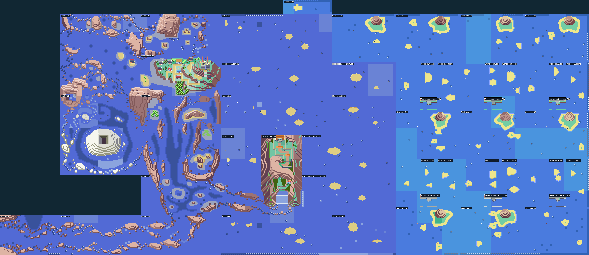

# Mar contínuo atrás de Ever Grande

A nova faixa fica **na borda leste de Hoenn, além de Mossdeep e atrás de
Ever Grande**, no ponto marcado na imagem. A antiga saída pelo sul da
Rota 131 foi retirada. Pacifidlog continua ligada pelas Rotas 131, 130 e 129;
dali é possível seguir pelo mar ampliado para as Sevii.



[Imagem sem legendas](eastern-union-gallery/eastern-union-terrain.png).
Candidata compilada: `42f4e3a434af77f03a3fb9468f6a14f975ecdfb6a80e1da0e751a0123ee27436`.

As imagens montam os blocos e tilesets reais nas coordenadas das conexões.
Este é um recorte do terreno jogável, não uma atualização da tela do PokéNav
nem uma imagem do mundo inteiro. As paletas originais das regiões permanecem.

## Continuidade

- Rota 125 e Mossdeep desembocam na parte norte do oceano ampliado.
- Rota 127 desemboca no mar ao norte e a oeste de Ever Grande.
- A faixa atrás de Ever Grande liga esse mar à parte sul, junto à Rota 129.
- Rota 128 conserva sua ligação original com a entrada de Ever Grande e
  ganha uma saída marítima ao sul, alinhada com a costa ampliada.
- O oceano comunica diretamente com as faixas de mar das Sevii 4/5 e 6/7;
  as passagens entre as fileiras de ilhas também foram preenchidas.
- Os seis portos dessas fileiras ocupam espaços próprios, cercados por mar.
  Os barcos, acessos às cidades e eventos originais dos portos são preservados.
- A passagem de Fuchsia desemboca no extremo norte da faixa ampliada.
  A conexão antiga disputava a mesma borda com a saída de Hoenn.

Os trechos formam um retângulo contínuo de 366 × 240 tiles, incluindo a ilha
original de Ever Grande e os portos. Não há mapas sobrepostos nem espaços
vazios entre as faixas desse retângulo. Praias pequenas e recifes completos
variam o terreno; as bordas externas sem conexão usam pedras aquáticas.

As viagens usam conexões nativas de borda e movimento por Surf, sem menus,
portas ou warps adicionados para atravessar esse oceano. O motor mantém
registros separados para os trechos, todos alinhados no mesmo plano.
Os penhascos naturais continuam impedindo entrar na montanha por qualquer lado;
a costa navegável de Ever Grande permanece ligada ao mar. O trecho de água
elevada atrás do penhasco tem uma margem visível de rochas do lado novo,
sem modificar os blocos originais da ilha.

## Correções do motor e preservação

Cada trecho tem dimensões compatíveis com o buffer do mapa e coordenadas
menores que 128, exigidas pelos destinos nativos de viagem. Foi corrigido
um limite inclusivo na escolha de conexões: o primeiro tile da conexão
seguinte não deve cair no mapa anterior. Os testes verificam início, meio
e fim das passagens navegáveis nos dois sentidos.

O terreno inteiro de Ever Grande e seus eventos permanecem iguais à camada
anterior, assim como os interiores dos 14 santuários e os cinco mapas Dive.
As áreas Dive anteriores mantêm suas coordenadas. A ampliação não altera os
habitats, Pokémon, equipes, níveis, scripts de missões ou requisitos das Ligas.
O jogo continua em inglês e esta candidata não atualiza o player publicado.

## Reprodução e limites dos testes

Aplicar `eastern-sea-union` após `sea-landscapes`:

```sh
python3 tools/hoenn/prepare_eastern_sea_union.py --source <fonte>
make -C <fonte> -j4
python3 tools/hoenn/verify_abilities.py --source <fonte-anterior> --candidate <fonte> --layer eastern-sea-union --output <resultados>
python3 tools/hoenn/render_eastern_union.py --source <fonte> --output <galeria>
python3 tools/hoenn/validate_eastern_union.py --source <fonte> --library <mgba-bridge.so> --output <resultados>
```

A preparação e os resultados da ROM compilada ficam em
[eastern-union-validation](eastern-union-validation). Os testes usam localização
inicial, equipe e flags como fixtures; as travessias contínuas usam os controles
do emulador. Isso não substitui duas campanhas completas nem valida o balanceamento.

## Resultado desta candidata

- Preparação reproduzida e idempotente: 133 arquivos verificados.
- 474 passagens navegáveis verificadas por Surf, nos dois sentidos.
- Viagem contínua de ida e volta por 17 etapas, com 15 mudanças de trecho
  e dois salvamentos/Continues, sem warps intermediários.
- 14 santuários, 105 altares bloqueados antes das 16 insígnias e 33 Continues
  verificados; 47 NPCs conferidos no terreno correto.
- As duas Ligas preservam a exigência de 16 insígnias: 2.048 combinações
  de permissões e oito casos de passagem física verificados.
- A ligação oeste também passou: 24 travessias e seis Continues.
- 250 testes de Hoenn e 12 de rotas marítimas passaram. Auditoria dos textos
  sem marcadores de português no jogo.

As travessias usam treinadores já derrotados e encontros selvagens desativados
na preparação do teste. A ROM mantém seus treinadores e encontros normais.
As duas campanhas completas e a atualização visual do PokéNav permanecem pendentes.
