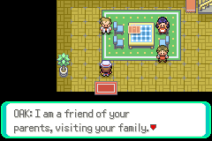
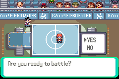

# Jogo em inglês

O idioma do jogo é **inglês**. A conversa com você e a documentação do projeto
continuam em português. Os textos originais já eram ingleses; 97 textos e
rótulos adicionados à integração foram traduzidos: família, mudança de cidade,
Oak/Birch, presentes, pós-jogo, santuários e PWT.

A camada `english-text` altera seis arquivos, exclusivamente literais de texto.
Comandos de eventos, escolhas, presentes, flags e declarações C permanecem
iguais. Os geradores históricos anteriores são mantidos para reproduzir suas
candidatas; a candidata atual aplica esta tradução depois de `sky-pillar-access`.
Não lançar uma candidata sem essa camada e a auditoria de idioma.

A auditoria verificou os hashes de 3.400 arquivos de fonte e examinou 116.572
literais entre aspas: nenhum correspondeu aos marcadores de português usados
pelo verificador. Isso é uma checagem de regressão textual, não uma classificação
linguística completa. As 160 linhas traduzidas de diálogo ficaram dentro de
208 pixels da fonte normal; a maior mediu 175. Placeholders usam os limites de
nome de Pokémon/treinador ou os textos conhecidos de presentes e rodada.

## Telas no motor

Viridian e Oldale passaram pela escolha da cidade, chegada, escada e casa.
O teste de diálogo inicia os scripts dos NPCs diretamente para encurtar a
viagem; os menus e as entregas são executados pelo jogo. As duas famílias dão
Surf, Dive e Waterfall, e os professores dão um inicial de nível 5 e a National
Dex. As primeiras páginas foram conferidas visualmente; os demais diálogos
não foram todos revisados em tela.




A inscrição do PWT também passou em inglês, com Singles de seis Pokémon,
sete recusas de inscrição inválida, ordem invertida válida e restauração da
equipe. Esta rodada de testes não joga um torneio completo.



## Capturas e correção da Master Ball

A tentativa com Nihilego mostrou um erro herdado: o cálculo de Ultra Beast
retornava antes de reconhecer a Master Ball, dando a ela a penalidade das
bolas comuns. A camada posterior `special-ball` move a captura garantida da
Master Ball para antes desse cálculo. A Beast Ball e as demais bolas mantêm
seus modificadores. Essa camada altera somente `src/battle_script_commands.c`.

| Pokémon | Categoria | Acesso | Continues | Resultado |
|---|---|---|---|---|
| Pecharunt | Mítico | Surf, santuário Eclipse | 2 | Captura e persistência passaram |
| Lugia | Lendário | Dive, santuário Origens | 3 | Captura e persistência passaram |
| Nihilego | Ultra Beast | Surf, santuário Cristais | 2 | Master Ball garantida e persistência passaram |

Cada caso recusa a interação com 15 insígnias, abre com oito de cada região
antes das Ligas, permite fugir e nocautear sem consumir o altar, e depois
captura pela bolsa. As transições e interações usam os controles normais,
com uma colocação inicial no mar por cenário. Foram 225 mudanças de posição
e nove transições pelos warps locais.

Os **sete Continues reais** conservam indivíduo capturado (espécie,
personalidade e treinador original), equipe, Pokédex, flag, posição e modo
terra/Surf/Dive. O NPC capturado continua ausente após Continue e nova entrada.
Interagir no antigo altar não inicia batalha nem duplica o Pokémon.

Equipe de nível 100, insígnias, Master Ball, posição inicial e ataque elevado
somente para acelerar o nocaute são fixtures. Os encontros aleatórios são
desativados. Esses resultados cobrem três dos 105 especiais; não validam
balanceamento, todas as capturas ou campanhas completas.

## Reprodução

Fonte fixada: `e05c82865d38a6638173fd30b2c830d1250aa50d`.
Base de Sky Pillar: `3b3e16d60b50a9be8105eaa8a62bb91ea7923f7748d0bfbd68be64a264fe544d`.
Texto inglês: `4800d9fed97751abe10320d5fc159d78cc794ec5fb2d0285fc8a5d622a029926`.
Candidata final: `15f9edd834559d723fcff3c8adb6e0ee87881e76c5c57702a38b044cc72b3509`.

Partir da candidata compilada de [SKY-PILLAR-ACCESS.md](SKY-PILLAR-ACCESS.md).
Usar diretórios novos para as cópias abaixo. Reprodução e idempotência das
duas camadas passaram, com sete arquivos alterados no total.

```sh
cp -a .local/hoenn-sky-access-src .local/hoenn-english-src
python3 tools/hoenn/prepare_english_text.py --source .local/hoenn-english-src
PATH="$PWD/.local/arm-gcc/usr/bin:$PWD/.local/arm-binutils/usr/bin:$PATH" make -C .local/hoenn-english-src -j4
python3 tools/hoenn/verify_abilities.py --layer english-text --source .local/hoenn-sky-access-src --candidate .local/hoenn-english-src --output mods/hoenn/english-text-validation/text
cp -a .local/hoenn-english-src .local/hoenn-special-ball-src
python3 tools/hoenn/prepare_special_ball.py --source .local/hoenn-special-ball-src
PATH="$PWD/.local/arm-gcc/usr/bin:$PWD/.local/arm-binutils/usr/bin:$PATH" make -C .local/hoenn-special-ball-src -j4
python3 tools/hoenn/verify_abilities.py --layer special-ball --source .local/hoenn-english-src --candidate .local/hoenn-special-ball-src --output mods/hoenn/english-text-validation/ball
python3 tools/hoenn/audit_english_text.py --baseline .local/hoenn-sky-access-src --candidate .local/hoenn-special-ball-src --output mods/hoenn/english-text-validation/english-audit.json
for dex in 1025 249 793; do
  python3 tools/hoenn/validate_special_capture_continue.py --source .local/hoenn-special-ball-src --library .local/mgba-bridge.so --national-dex "$dex" --output "mods/hoenn/english-text-validation/capture-$dex"
done
for city in 1 17; do
  python3 tools/hoenn/validate_english_dialogue.py --source .local/hoenn-special-ball-src --library .local/mgba-bridge.so --city "$city" --output "mods/hoenn/english-text-validation/home-$city"
done
python3 tools/hoenn/validate_pwt_six.py --source .local/hoenn-special-ball-src --library .local/mgba-bridge.so --output mods/hoenn/english-text-validation/pwt
python3 -m unittest discover -s tools/hoenn -v
python3 -m unittest discover -s tools/sea_routes -v
```

O player permanece na versão anterior. Esta candidata ainda requer jogo
novo e não foi publicada. As campanhas completas e os demais trabalhos
continuam em [REMAINING-WORK.md](REMAINING-WORK.md).
