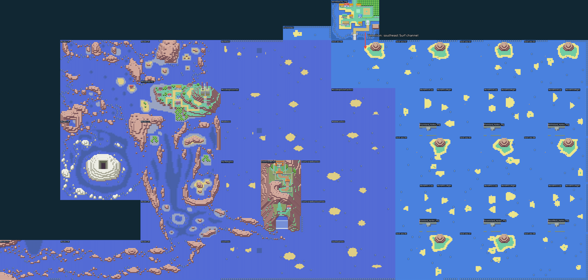
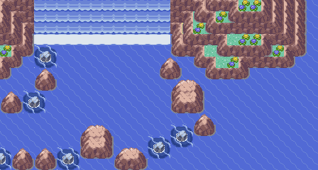
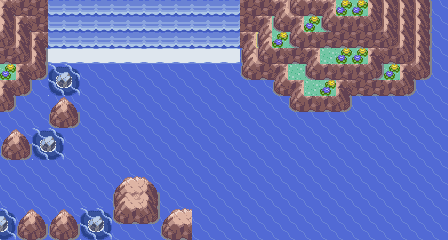

# Entrada leste de Ever Grande e chegada a Vermilion

> A ligação de Vermilion descrita abaixo foi substituída pelo [estaleiro da Rota 12](ROUTE12-SHIPYARD.md). A passagem de Fuchsia e a abertura de Ever Grande permanecem.

A faixa de mar a leste de Hoenn chega ao oceano das Sevii. A ligação com
Vermilion é **pela borda sul da cidade, no canal de Surf da costa sudeste**:
Vermilion `(34, 38)` → borda sul `(34, 39)` → `JourneyWorldSea00 (34, 0)`.
O cais original e seus eventos permanecem. Uma seta vermelha indica esse canal.

Fuchsia chega pela Rota 19: sai pelo sul da cidade, segue para leste no mar
da Rota 19 e entra no canal `JourneyFuchsiaSea`; dali desce ao mar norte
de Hoenn. A segunda seta marca essa passagem. A extensão de seis tiles
do canal alinha a borda inteira da Rota 19, sem sobrepor o mar de Hoenn.



Este recorte usa os tiles reais e as coordenadas das conexões do jogo.
Inclui Fuchsia, a Rota 19, Vermilion, o mar leste de Hoenn e as faixas marítimas das Sevii;
ainda não é o mapa completo de Kanto nem a nova tela do PokéNav.

## Abertura do recife

Foram retirados 31 tiles de rochas no mar abaixo da costa, na lateral leste
da entrada original de Ever Grande. O canal permite navegar entre a base da
cachoeira e o mar atrás da ilha. A cachoeira, a piscina superior, as montanhas,
os eventos e a exigência de 16 insígnias para a Liga permanecem.

Antes:



Depois:



Camada `ever-grande-entrance`, aplicada após `eastern-sea-union`.
A preparação modifica o recife de Ever Grande e amplia o canal de Fuchsia de 14 para
20 tiles de altura, preservando os eventos;
reprodução determinística e idempotência registradas em
[ever-grande-entrance-validation/preparation](ever-grande-entrance-validation/preparation).

```sh
python3 tools/hoenn/prepare_ever_grande_entrance.py --source <fonte>
make -C <fonte> -j8
python3 tools/hoenn/validate_ever_grande_entrance.py --source <fonte> --library <mgba-bridge.so> --output <resultados>
python3 tools/hoenn/render_eastern_union.py --source <fonte> --output <galeria> --include-vermilion
```

Candidata compilada: `f939526a55c5db284875addeebeb963402c70f65a64d9d9975d9212467ce4f9f`.

A validação de viagem usa equipe, posição inicial, treinadores já derrotados
e encontros selvagens desativados como fixtures. Não representa duas campanhas
completas nem valida o balanceamento. Não há publicação da ROM ou do player.

Viagem nativa concluída, sem warps intermediários: Fuchsia → Rota 19 →
canal leste → mar norte de Hoenn → Vermilion → mar das Sevii → entrada
leste de Ever Grande → base da cachoeira → Vermilion → Fuchsia.
Foram registradas 27 mudanças de trecho e um save/Continue junto à cachoeira.
253 testes de Hoenn e 12 de rotas marítimas passaram.
