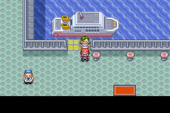
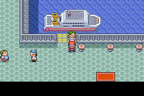

# S.S. Tidal e acesso à Battle Frontier

A recepção de Slateport e a de Lilycove agora conferem o **S.S. Ticket** antes
de oferecer destinos. O requisito original de ser campeão de **Hoenn** permanece;
ser campeão apenas de Kanto não libera o cruzeiro nativo. O bilhete é o que a
família da residência escolhida entrega após a Liga de Hoenn, sem duplicação.

Antes, os dois portos pressupunham que o jogador já havia recebido o bilhete.
Na integração, a entrega ocorre ao visitar a família: era possível embarcar sem
buscá-lo, chegar à Frontier e descobrir que sua recepção de volta exigia o item.
Os três pontos de embarque agora usam o mesmo requisito de posse do bilhete.
O bilhete não é consumido.

A primeira viagem ainda apresenta Scott no S.S. Tidal. Sua cena libera a
Battle Frontier nos menus dos portos; não foi substituída por flags de atalho.
As cabines, cama, marinheiro de saída, destinos e animações nativas foram mantidos.
O transporte entre regiões e as travessias por Surf têm suas regras anteriores;
esta revisão trata somente do cruzeiro nativo de Hoenn.

## Camada reproduzível

`frontier-travel` segue `pwt` e altera dois scripts: as recepções de Slateport
e Lilycove. Os scripts de Scott, menus de viagem, retorno da Frontier, família,
PWT e escalonamento dos ginásios são preservados por hash. O formato dos saves
não mudou.

```sh
cp -a .local/hoenn-pwt-src .local/hoenn-frontier-travel-src
python3 tools/hoenn/prepare_frontier_travel.py --source .local/hoenn-frontier-travel-src
# Compilar modern com a toolchain de INTEGRATION.md.
python3 tools/hoenn/verify_abilities.py --source .local/hoenn-pwt-src --candidate .local/hoenn-frontier-travel-src --layer frontier-travel --output mods/hoenn/frontier-travel-validation
python3 tools/hoenn/validate_frontier_travel.py --source .local/hoenn-pwt-src --library .local/mgba-bridge.so --output mods/hoenn/frontier-travel-validation/baseline --baseline
python3 tools/hoenn/validate_frontier_travel.py --source .local/hoenn-frontier-travel-src --library .local/mgba-bridge.so --output mods/hoenn/frontier-travel-validation/native
python3 tools/hoenn/validate_frontier_pwt.py --source .local/hoenn-frontier-travel-src --library .local/mgba-bridge.so --output mods/hoenn/frontier-travel-validation/pwt
```

Candidata:
`92c95316b5019ac31cfde8e3cc4476895e61f33714b18ec27478b702cc54a335`.
Base PWT com seis Pokémon:
`4f1a70a006854cf304c32a5cdb80bd7009d779dddc5a6a43f573bbb7a6610b56`.

## Evidência nativa

- Base anterior: oito combinações de campeão/bilhete nos dois portos; ambas
  as recepções ofereciam destinos ao campeão sem o bilhete.
- Candidata: oito combinações exercitadas pela interação física com as
  atendentes; só campeão de Hoenn com o bilhete vê os destinos.
- Primeira viagem de Slateport, cena real de Scott, entrada física na cabine 2,
  interação com a cama e saída pelo marinheiro até Lilycove.
- Lilycove → Frontier → Slateport → Frontier → Lilycove, pelos menus e
  animações reais, sem warps de fixture entre essas viagens. O bilhete continua
  com quantidade um.
- Salvamento/recarregamento e **Continue nativo** em Slateport antes do segundo
  embarque e em Lilycove ao terminar. `LoadGameSave` sozinho não reconstrói os
  NPCs já carregados; o teste usa `CB2_ContinueSavedGame` para essa retomada.
- Uma partida PWT **seis contra seis** na mesma candidata, com bloqueio da
  bolsa e Battle Bond, seguida por desistência na rodada seguinte. Equipe,
  BP, dinheiro e flags permanecem iguais, inclusive após save/reload.





Flags de campeão, visibilidade dos NPCs e viagens iniciais aos portos são
fixtures. O bilhete é colocado na bolsa pelo helper nativo para os casos de
entrada; a entrega pela família foi testada na etapa `family-postgame`.
A partida PWT usa atributos aumentados em RAM, como os testes de [PWT.md](PWT.md).
Esses resultados não são campanhas completas nem teste de balanceamento.
As demais instalações da Frontier ainda precisam de revisão. A ROM do player
não foi substituída.
