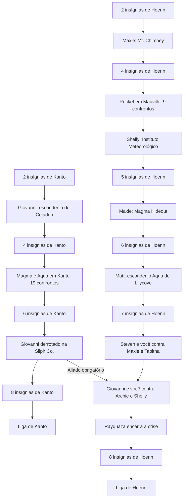

# História conectada de Kanto, Hoenn e Sevii

As histórias estão integradas pelos episódios definidos para o projeto. Elas
mantêm duas contagens de insígnias e duas Ligas, mas compartilham acontecimentos:
Magma/Aqua invadem Kanto, Rocket opera sob o cassino de Hoenn, e Giovanni precisa
ter sido derrotado na Silph Co. para ajudar contra Archie e Shelly.

O nome correto é **histórias conectadas com progressão regional**. “Campanhas
independentes” não descreve mais o jogo: o final de Hoenn tem uma dependência
obrigatória de Kanto. A auditoria atual registra isso explicitamente, sem mudar
as regras do motor. Relatórios antigos descrevem etapas anteriores e conservam
suas próprias evidências.

## Sequência atual

A ordem dos ginásios é livre. Os números abaixo são a quantidade de insígnias
daquela região, não um líder específico. Ginásios já vencidos podem ser revisitados.
Os guias bloqueiam os ainda não vencidos enquanto houver a missão obrigatória
pendente e indicam a equipe e o local. A escala de níveis dos ginásios e de seus
trainers continua baseada nessa quantidade regional.

| Região / avanço | Missão obrigatória | Ginásios que esperam |
|---|---|---|
| Kanto, 2 insígnias | Giovanni no esconderijo sob o Game Corner de Celadon | A partir do 3º |
| Kanto, 4 insígnias | Magma em Pewter/Rock Tunnel, Aqua em Vermilion e no corredor aquático oeste; incursões nas rotas 3, 6, 8 e 15 | A partir do 5º |
| Kanto, 6 insígnias | Giovanni na Silph Co., após concluir as missões anteriores | Os dois últimos |
| Hoenn, 2 insígnias | Maxie no Mt. Chimney | A partir do 3º |
| Hoenn, 4 insígnias | Base Rocket sob o cassino de Mauville, dois andares com grunts e Atlas | A partir do 5º |
| Hoenn, 4 insígnias | Shelly no Instituto Meteorológico, Rota 119 | A partir do 5º |
| Hoenn, 5 insígnias | Maxie no Magma Hideout, preservando a missão do Magma Emblem | A partir do 6º |
| Hoenn, 6 insígnias | Matt no esconderijo Aqua em Lilycove; preservando o roubo em Slateport | A partir do 7º |
| Hoenn, 7 insígnias | Steven com você contra Maxie/Tabitha no Centro Espacial | O último |
| Hoenn, 7 insígnias | Giovanni com você contra Archie/Shelly na Seafloor Cavern; exige a Silph de Kanto | O último |
| Hoenn, 7 insígnias | Despertar Rayquaza e encerrar a crise climática em Sootopolis | O último |
| Cada região, 8 insígnias | Liga daquela região | As insígnias da outra região não substituem nenhuma |



## Ligação entre as equipes

Os Magma de Pewter reclamam da presença de Aqua e querem dominar o mundo.
Os Aqua de Vermilion sabem que Magma está perto, mas ainda não identificaram
Rock Tunnel. Há membros adicionais em quatro rotas de Kanto e no corredor
Cinnabar–rio oeste de Hoenn–Rustboro/Dewford. As outras conexões marítimas
continuam com treinadores comuns.

O cassino de Mauville financia a célula Rocket comandada por Atlas. Seus dois
subsolos pertencem à missão de Hoenn; limpar essa base não conclui as incursões
de Kanto, e limpar Kanto não conclui a base de Hoenn.

Na Seafloor Cavern, Giovanni explica seu arrependimento e o propósito inicial
de defender Kanto contra Magma/Aqua, reconhecendo que Rocket perdeu esse
propósito e causou danos. Ele participa da batalha como aliado. Viridian
continua com **Blue** como líder regular; esse ginásio não é uma missão Rocket.

## Liberdade de viagem

As conexões por Surf unem fisicamente Kanto, Hoenn e Sevii. As missões fecham
ginásios, não todas as estradas. Permanecem Snorlax, os terrenos que usam Surf,
Dive/Waterfall e as missões de bicicleta já definidas. Não há Whirlpool, nem
necessidade dos antigos HMs terrestres ou de Acro Bike.

Se você avançar primeiro em Hoenn até sete insígnias, o guia pedirá a Silph
caso ela esteja pendente: é necessário avançar Kanto até seis insígnias e
vencer Giovanni. Essa ligação foi solicitada como obrigatória. Se a Silph já
estiver concluída, o aliado estará liberado quando Hoenn chegar a esse ponto.

## Validação da revisão anterior

Os relatórios em `story-progress-validation` usam a candidata
`92c95316b5019ac31cfde8e3cc4476895e61f33714b18ec27478b702cc54a335`.
Foram vencidas batalhas reais dos 28 encontros adicionais, verificando flags de vitória,
a próxima missão, a pendência da outra região e a conservação das insígnias.
O teste também confere portas físicas de ginásios fechadas/abertas e
salvamento/Continue entre missões, sem marcar os treinadores como vencidos
para simular essas vitórias.

Uma execução adicional pegou o Card Key no quinto andar da Silph, abriu a
porta do décimo primeiro andar, confirmou a recusa de Giovanni com cinco
insígnias e o venceu pelo evento original com seis. A cena marcou a conclusão
da Silph e mudou a pendência de Hoenn de “concluir Silph” para “enfrentar Archie”.
A permissão foi conferida nas duas regiões e após salvar/Continue. Nesse teste
isolado, as missões anteriores e a conclusão do Centro Espacial são fixtures;
suas vitórias não estão sendo contadas novamente.

Insígnias iniciais, conclusão dos episódios anteriores, viagens e entrada no
script do NPC são fixtures. A equipe usa nível 100 e atributos aumentados em
RAM. Isso não testa balanceamento, caminhada entre todas as rotas nem duas
campanhas completas. As batalhas de Steven/Giovanni e seus desfechos têm seus
relatórios próprios em `aftermath-validation`.

```sh
python3 tools/hoenn/audit_campaigns.py --source .local/hoenn-frontier-travel-src --output mods/hoenn/story-progress-validation/campaign-dependencies.json
python3 tools/hoenn/validate_team_missions.py --source .local/hoenn-frontier-travel-src --library .local/mgba-bridge.so --output mods/hoenn/story-progress-validation
python3 tools/hoenn/validate_silph_connection.py --source .local/hoenn-frontier-travel-src --library .local/mgba-bridge.so --output mods/hoenn/story-progress-validation/silph
```

A revisão seguinte tornou Shelly e Matt obrigatórios e removeu exigências de
golpes terrestres em três passagens dos Regis. Testes, nova candidata e limites
em [PUZZLES-AND-AQUA.md](PUZZLES-AND-AQUA.md).

A ROM do player não foi atualizada. As prioridades restantes estão em
[REMAINING-WORK.md](REMAINING-WORK.md).
