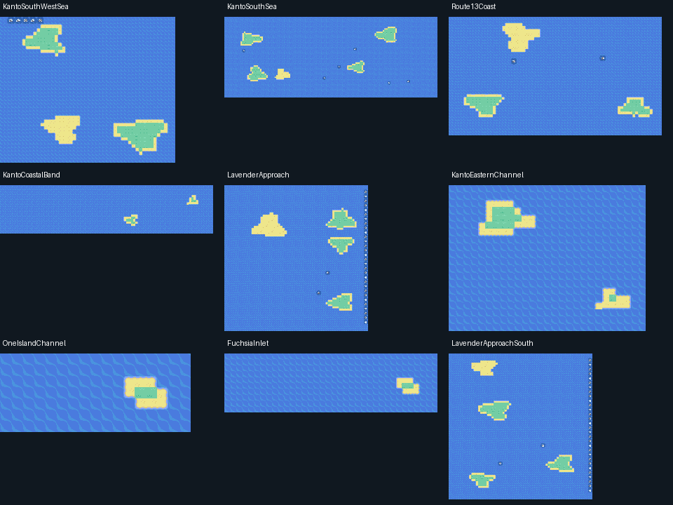
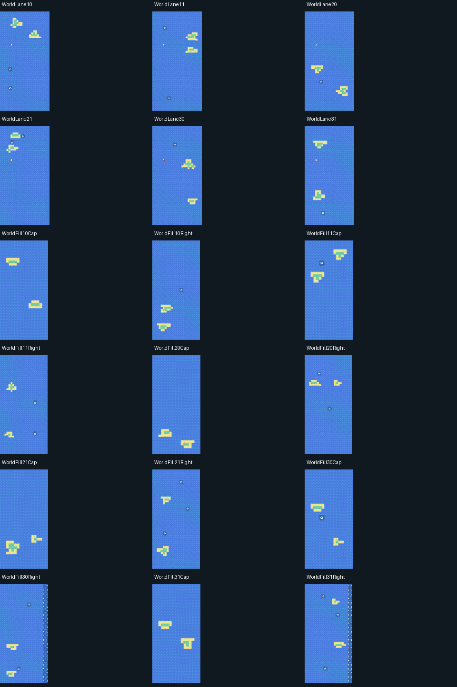

# Costa de Fuchsia — Lavender Port — oceano leste

A ligação respeita as posições obtidas das conexões reais de Kanto, em vez de aproximar Lavender Port de Fuchsia apenas no desenho do mapa. O trecho abre nove mapas marítimos contíguos: Fuchsia Coast, Kanto South Sea, Route 13 Coast, Kanto Coastal Channel, Lavender Approach, Kanto Eastern Channel One Island Channel Fuchsia Inlet e Lavender Approach South.

O porto da One Island ocupa seu próprio espaço entre os canais; seu terreno não é coberto por outro mapa. O acesso antigo de Vermilion por Surf continua retirado.

A ponte parte da passarela existente da Rota 12, atravessa Lavender Outer Sea e chega ao braço noroeste do estaleiro. A casa, a ilha central e os barcos aprovados permanecem em seus lugares. A ponte é uma passagem a pé.

O oceano une a costa de Fuchsia ao mar abaixo das Rotas 14 e 13, à aproximação de Lavender Port e aos mares que levam a Hoenn e Sevii. São conexões de borda com offsets recíprocos; não se usa teleporte ou warp para cruzar essas fronteiras.

O mapa do jogo mostra mar uniforme, a área navegável em azul escuro e a ponte em amarelo. Nomes e diálogos permanecem em inglês.

Os trechos novos têm ilhotas compactas, com lados desiguais, pequenas enseadas e pontas de areia, com interiores verdes e praias de areia, recifes espaçados e pedras aquáticas completas de 2×2 tiles nas bordas sem conexão. Os corredores centrais e as faixas abertas entre mapas permanecem livres. A maior parte de cada mapa continua sendo água.

Os 18 canais e complementos anteriores tiveram as faixas compridas de areia substituídas por ilhotas compactas, preservando os treinadores, seus eventos e as conexões. A Rota 20 teve dois pedregulhos aquáticos completos retirados para ligar por Surf seus dois lados, mantendo as montanhas, as praias e as entradas de Seafoam. A ida e volta por controles agora parte da Rota 19, atravessa a Rota 20, passa por Cinnabar e chega a Dewford.

[Conferência dos 54 mapas marítimos](SEA-NETWORK-AUDIT.md).
