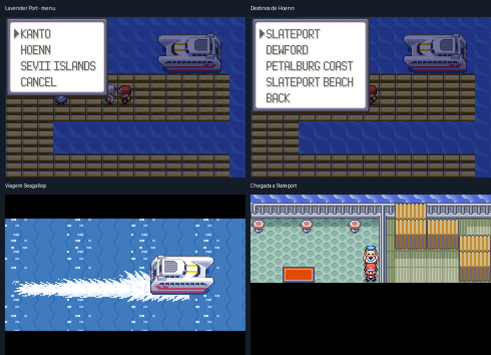

# Lavender Port e a rede de barcos

O estaleiro na costa leste da Rota 12 chama-se **Lavender Port**. O nome aparece na identificação do lugar e nos menus. Sua madeira, a ilha de grama e areia, a casa e os barcos permanecem como aprovados.

A rede integra os barqueiros de transporte de Kanto, Hoenn e Sevii. O porto em que você está é retirado da lista de destinos. Todos usam o mesmo World Ticket reutilizável, entregue pelo barqueiro caso você ainda não tenha.

| Região | Destinos |
| --- | --- |
| Kanto | Lavender Port, Vermilion |
| Hoenn — oeste | Slateport, Dewford, Petalburg Coast (Rota 104), Slateport Beach (Rota 109) |
| Hoenn — leste | Lilycove, Pacifidlog, Mossdeep, Sootopolis |
| Hoenn — Frontier | Battle Frontier |
| Sevii | One, Two, Three, Four, Five, Six e Seven Island |

Todas as viagens da rede usam a animação nativa do **Seagallop**, com navegação, rastro na água e desembarque no porto escolhido. O mesmo barco da animação atende aos destinos das três regiões. As viagens locais mantêm suas cenas originais.



Vermilion tem serviço de barco; a antiga passagem de Surf continua fechada. O caminho de Surf pela Rota 12 e a passagem de Fuchsia permanecem.

Os atendentes originais oferecem `WORLD PORTS` e `LOCAL SERVICES`. Os diálogos e as viagens originais ficam preservados no serviço local, incluindo Mr. Briney, o resgate de Peeko e a primeira viagem da S.S. Tidal com Scott. A Battle Frontier continua exigindo o acesso original: título de campeão de Hoenn, S.S. Ticket e a primeira passagem com Scott. A rede permite voltar à Frontier depois disso. O capitão da S.S. Anne mantém sua missão original.

Os antigos capitães de chegada de Dewford, Pacifidlog, Mossdeep e Sootopolis passam a usar o menu completo. Há atendentes permanentes nas costas de Petalburg e Slateport, disponíveis mesmo quando Mr. Briney mudou de lugar.

## Reprodução e validação

Camada `lavender-network`, aplicada após `route12-port`. Os nomes usados pelo jogador estão em inglês. Os IDs internos do estaleiro permanecem compatíveis com a camada anterior.

```sh
python3 tools/hoenn/prepare_lavender_network.py --source <fonte>
make -C <fonte> -j8
python3 tools/hoenn/verify_abilities.py --layer lavender-network --source <fonte-anterior> --candidate <fonte> --output <reproducao>
python3 tools/hoenn/validate_lavender_network.py --source <fonte> --library <mgba-bridge.so> --output <viagens>
```

A candidata `ec563245` compilou e completou um circuito com **18 viagens**, observando a animação nativa em todas. Os testes registram os menus reais dos 18 portos sem o próprio destino e quatro casos de acesso bloqueado à Frontier. A volta a Lavender Port passou por salvar/Continue. A viagem original do Seagallop também passou nas duas direções entre Vermilion e One Island. A camada foi reproduzida a partir da anterior e sua reaplicação não altera arquivos. A equipe, flags de treinadores derrotados e os pré-requisitos da Frontier são fixtures. O teste da viagem original entra diretamente no script de embarque. Isso não representa uma conclusão das campanhas. Os relatórios ficam em [lavender-network-validation](lavender-network-validation).

Este PR não publica uma ROM ou um player. A versão jogável fica para o PR seguinte, conforme solicitado.
