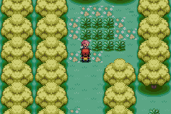
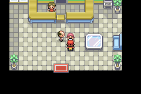

# Resgate de Lostelle no mundo conectado

A sequência Bill/Celio → Meteorite → pai de Lostelle → quatro motoqueiros →
Berry Forest → Hypno → resgate → entrega do Meteorite passou por controles
nativos, com zero insígnias nas duas regiões. A personagem retorna ao pai
pela escolta original do evento, recebe-se a Moon Stone e uma revisita à
floresta confirma que Lostelle não inicia outra batalha.

Foram **15 mapas, 1.646 mudanças de posição observadas, nove ativações de
Surf e oito Continues**. O caminhador registrou **39 transições** durante
os percursos; a escolta de Lostelle inclui ainda o warp original do evento
para o Game Corner da Ilha 2, executado pelo jogo.

## Sequência exercitada

1. Entrada no Centro Pokémon da Ilha 1 e apresentação de Bill/Celio,
   recebendo Meteorite e Tri-Pass pelos eventos originais.
2. Visita ao Joyful Game Corner, pedido do pai e abertura da sequência dos
   motoqueiros na Ilha 3.
3. Quatro confrontos consecutivos contra os treinadores 1263, 1264, 1265
   e 1477, com avanço da cena da Ilha 3 para 4.
4. Caminhada por Bond Bridge até Lostelle, sem Cut ou outro HM terrestre.
5. Batalha nativa contra Hypno, Iapapa Berry e escolta original para a Ilha 2.
6. Entrega do Meteorite ao pai, Moon Stone e saída/nova entrada no Game Corner,
   que avança legitimamente sua cena de 3 para 4.
7. Revisita ao lugar de Lostelle, sem outro Hypno, e retorno ao mar inicial.

As três batalhas adicionais de Bond Bridge surgiram pelas linhas de visão
normais dos treinadores 1293, 1259 e 1294. São **oito batalhas no total**:
sete contra treinadores e uma contra Hypno. Vitórias e flags dos treinadores
foram verificadas; não foram atribuídas sinteticamente.





## Níveis, itens e persistência

Hypno apareceu no **nível 100** na nova execução, com média da equipe **100**, dentro da faixa
−5/+2 limitada a 1–100. O evento original anuncia um encontro fixo de nível 30,
mas a rotina nativa já normaliza seu nível pela regra da jornada. Não foi
necessária uma alteração na ROM para manter essa regra nesta batalha.

O Meteorite passa de 0 para 1 durante a apresentação e volta a 0 na entrega.
A Iapapa Berry e a Moon Stone passam de 0 para 1; as quantidades persistem
nas revisitas e nos Continues. As duas contagens de insígnias permanecem em 0.

Os oito Continues cobrem apresentação de Celio, pedido do pai, motoqueiros
vencidos, floresta antes do resgate, reencontro, recompensa, revisita à
floresta e volta ao mar. Todos preservaram mapa, posição, modo, cenas,
flags de resgate e quantidades dos itens observados.

## Validador e reprodução

O resgate foi repetido na candidata em inglês `0f1df908`, após a troca
de famílias descrita em [LOSTELLE-HABITATS.md](LOSTELLE-HABITATS.md). O validador usa os
IDs e offsets compilados dos cabeçalhos fixados. A lista de treinadores
inclui os scripts compartilhados de `trainers_frlg.inc`: os NPCs de Bond
Bridge referenciam esse arquivo, em vez de declarar as batalhas no script
local do mapa.

A rotina de avanço mantém a continuação dos scripts durante os quatro
confrontos seguidos. Chamadas pelo trampoline de validação ficam reservadas
para checkpoints sem cena ativa, evitando substituir o contexto do evento.

- [Relatório nativo](lostelle-story-validation/lostelle-story.json).
- Base e construção: [EASTERN-OCEAN-JOURNEY.md](EASTERN-OCEAN-JOURNEY.md).

```sh
python3 tools/hoenn/validate_lostelle_story.py --source .local/hoenn-lostelle-habitats-src --library .local/mgba-bridge.so --output mods/hoenn/lostelle-story-validation
python3 -m unittest discover -s tools/hoenn -p test_lostelle_story.py -v
```

Uma colocação inicial, equipe preparada e estados anteriores da história
são fixtures. Atributos de batalha e PP foram aumentados para validar a
sequência, sem medir dificuldade. Encontros aleatórios ficam desligados;
o Hypno do evento é criado normalmente. Não há warps de fixture no meio
da viagem ou entrada direta nos scripts dos NPCs. O warp da escolta é o
original do jogo. Não comprova as missões seguintes de Ruby/Sapphire,
funcionamento dos minigames, bolsas cheias, outras escolhas de batalha,
balanceamento ou campanhas completas. O player mantém a versão anterior.
