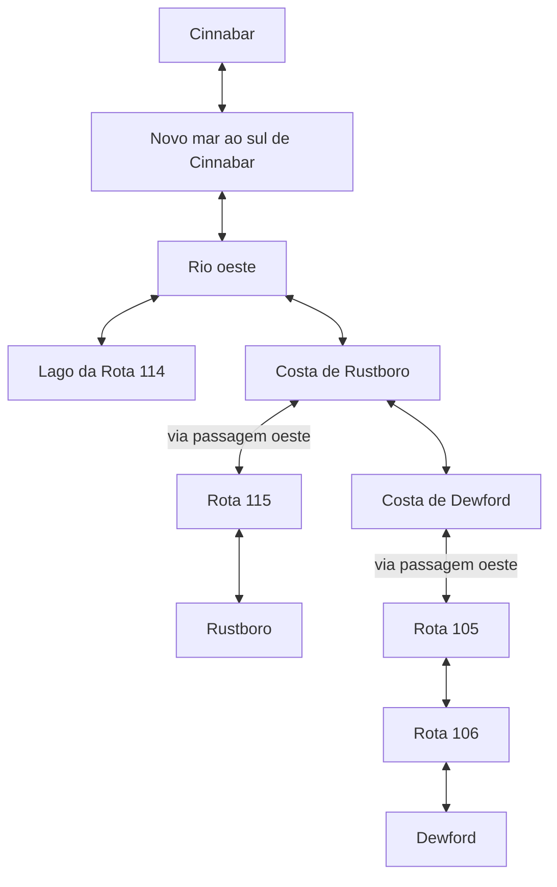
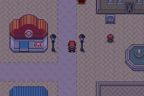
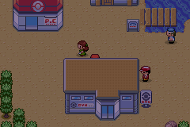

# Viagem contínua pelo mar oeste

A candidata em inglês passou por uma viagem contínua de **Cinnabar até
Rustboro e Dewford**, incluindo o lago da Rota 114 e a volta a Cinnabar.
Foram **13 mapas, 24 travessias de borda, 1.262 mudanças de posição,
12 ativações de Surf, cinco batalhas e seis Continues**.

Não houve alteração na ROM. O planejador de validação agora entende
conexões de mapa com offsets positivos/negativos e diferenças de elevação.
A praia da Rota 115 e seus penhascos são níveis distintos; a primeira
modelagem ignorava isso e tentava subir onde o jogo impede corretamente.
O percurso validado usa as passagens reais, sem editar alturas ou colisões.

## Percurso



Os mapas de passagem `JourneyRustboroGate` e `JourneyDewfordGate` foram
percorridos em ambos os sentidos. O roteiro parte do chão de Cinnabar,
ativa Surf pela interação da margem, desembarca nas cidades e retorna ao
mesmo tile inicial. Uma colocação inicial e a equipe são fixtures; não há
teletransportes intermediários nem entrada direta nos scripts dos treinadores.





## Estado e regressões

Os Continues foram feitos no mar ao sul de Cinnabar, lago da Rota 114,
costa de Rustboro, cidade de Rustboro, Dewford e retorno a Cinnabar. Todos
preservaram posição, formato do mapa e modo: três em Surf e três em terra.
As duas regiões conservaram zero insígnias e capturas especiais bloqueadas.

Os cinco confrontos surgiram pelas linhas de visão normais dos NPCs:
treinador 1534 no novo rio, 441/151 na Rota 105 e 339/153 na Rota 106.
Vitórias e flags de derrota são nativas. Os atributos de batalha foram
aumentados e a cura é uma fixture; isso não mede dificuldade ou consumo de PP.
Os encontros selvagens foram desativados e estados anteriores da história
foram preparados pelo bootstrap compartilhado.

O novo planejador também passou novamente pelos **14 santuários e 105
interações bloqueadas**, com 33 Continues, e por **Sky Pillar**, incluindo
queda, retorno, recusa de despertar antecipado e três Continues.

- [Viagem completa](ocean-journey-validation/native/ocean-journey.json).
- [Regressão dos santuários](ocean-journey-validation/sanctuaries/sanctuary-routes.json).
- [Regressão de Sky Pillar](ocean-journey-validation/sky-pillar/sky-pillar-access.json).

## Reprodução e limites

Usar a candidata de [ENGLISH-GAME.md](ENGLISH-GAME.md), SHA-256
`15f9edd834559d723fcff3c8adb6e0ee87881e76c5c57702a38b044cc72b3509`.
Não é necessário recompilar para esta etapa: as mudanças são no validador.

```sh
python3 tools/hoenn/validate_ocean_journey.py --source .local/hoenn-special-ball-src --library .local/mgba-bridge.so --output mods/hoenn/ocean-journey-validation/native
python3 tools/hoenn/validate_sanctuary_routes.py --source .local/hoenn-special-ball-src --library .local/mgba-bridge.so --output mods/hoenn/ocean-journey-validation/sanctuaries
python3 tools/hoenn/validate_sky_pillar_access.py --source .local/hoenn-special-ball-src --library .local/mgba-bridge.so --output mods/hoenn/ocean-journey-validation/sky-pillar
python3 -m unittest discover -s tools/hoenn -v
python3 -m unittest discover -s tools/sea_routes -v
```

Esse roteiro valida a viagem oeste, não todas as viagens de Kanto/Hoenn/Sevii.
O planejador considera os mapas incluídos no cenário; scripts dinâmicos,
objetos e colisões continuam sendo resolvidos pelo motor. Caminhos com
outros puzzles e mecanismos ainda precisam de seus próprios testes.

O player permanece na versão anterior. Faltam as campanhas completas,
viagens extensas no mar leste/Sevii, demais puzzles, serviços do pós-jogo,
balanceamento e sessões prolongadas no navegador. Não existe porcentagem
confiável de conclusão. [REMAINING-WORK.md](REMAINING-WORK.md).
