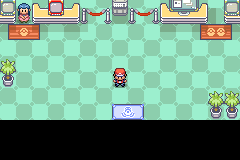

# PWT — torneio Singles na Battle Frontier

O guia no lobby do Battle Dome oferece uma visita à recepção própria do PWT.
A atendente do balcão esquerdo inscreve você. A porta de saída devolve você ao
Dome; suas recepções e desafios originais continuam disponíveis.



## Regras

- Somente Singles, conforme solicitado: seis Pokémon por equipe. Leve seis elegíveis e escolha a ordem dos seis.
- Oito participantes; quartas de final, semifinal e final. Três vitórias dão o título.
- O sorteio mostra a chave antes de cada rodada. Os outros confrontos são resolvidos
  por sorteio; você disputa suas três partidas no motor normal de batalha.
- Todos os Pokémon entram no nível 50, inclusive os seus que estão abaixo ou acima.
- Não entram ovos, espécies banidas pela lista nativa da Frontier, espécies repetidas
  ou itens repetidos. Formas da mesma espécie contam pelo número da Pokédex Nacional.
  Vários Pokémon sem item são permitidos.
- Itens da bolsa ficam bloqueados. O estilo de batalha é Set, sem troca gratuita
  quando o adversário manda outro Pokémon. Run permite desistir da partida.
- Antes de cada batalha, HP, PP, status e itens dos seis selecionados são restaurados.
- Vitória no torneio dá 3 BP, até o limite de 9.999. Derrota ou desistência não premia.
- Ao terminar, a equipe completa retorna ao estado da inscrição: mesma ordem,
  níveis, experiência, habilidades, personalidade, itens, golpes e condições.
- O torneio não concede experiência, dinheiro, insígnias, conquistas de Liga
  ou vitórias de missões. Battle Bond continua funcionando em batalha, e a
  transformação não substitui permanentemente o Greninja original.

O torneio usa as regras de disputa do PWT em uma adaptação ao motor GBA. A chave
é apresentada em texto, e os cenários e retratos usam os recursos já disponíveis.
Não é uma reprodução integral da interface e de todos os torneios de Black 2/White 2.

## Torneios e participantes

| Torneio | Conjunto de adversários |
|---|---|
| Kanto | Brock, Misty, Lt. Surge, Erika, Koga, Sabrina, Blaine e Blue |
| Hoenn | Roxanne, Brawly, Wattson, Flannery, Norman, Winona, Tate e Liza como dupla de líderes, e Juan |
| Misto | Os líderes acima, Wallace e Steven |

Cada inscrição sorteia sete adversários distintos e a posição do jogador na
chave. São 18 entradas de treinadores no conjunto misto; Tate/Liza ocupam uma
entrada e disputam Singles com uma equipe de seis Pokémon.

Cada treinador tem um conjunto próprio de seis espécies associado à sua
especialidade, com os seis Pokémon em cada partida, em ordem sorteada. A lista está em
[tools/hoenn/pwt.c](../../tools/hoenn/pwt.c). Os adversários têm IVs 31, EVs em
velocidade e ataque físico ou especial conforme seus atributos, e os golpes
aprendidos até o nível 50. Os itens são escolhidos sem repetição entre
Leftovers, Life Orb, Focus Sash, Sitrus Berry, Expert Belt e Lum Berry.
Não são distribuídas Mega Stones nem novos itens de acesso a Megas pelo PWT.

## Módulo e reprodução

A camada `pwt` é aplicada depois de `family-postgame`. Ela acrescenta o arquivo
C independente, seus scripts e duas salas. Um bit de batalha até então sem uso
identifica suas regras; as rotinas do Dome e do escalonamento dos ginásios têm
seus bytes preservados e verificados. O formato dos saves permanece igual.
A equipe temporária e a chave ficam em RAM. Não existe suspensão de torneio
em save nativo: fechar o jogo retorna ao último save, sem salvar as cópias
normalizadas. Ao concluir, os BP podem ser gravados pelo salvamento normal.

```sh
cp -a .local/hoenn-family-postgame-src .local/hoenn-pwt-src
python3 tools/hoenn/prepare_pwt.py --source .local/hoenn-pwt-src
# Compilar `modern` com a toolchain descrita em INTEGRATION.md.
python3 tools/hoenn/verify_abilities.py --source .local/hoenn-family-postgame-src --candidate .local/hoenn-pwt-src --layer pwt --output mods/hoenn/pwt-validation
python3 tools/hoenn/validate_pwt.py --source .local/hoenn-pwt-src --library .local/mgba-bridge.so --output mods/hoenn/pwt-validation/native
python3 tools/hoenn/validate_pwt_six.py --source .local/hoenn-pwt-src --library .local/mgba-bridge.so --output mods/hoenn/pwt-validation/six
python3 tools/hoenn/validate_pwt_access.py --source .local/hoenn-pwt-src --library .local/mgba-bridge.so --output mods/hoenn/pwt-validation/access
python3 tools/hoenn/validate_campaign_matrix.py --source .local/hoenn-pwt-src --library .local/mgba-bridge.so --output mods/hoenn/pwt-validation
python3 tools/hoenn/audit_native_catalog.py --source .local/hoenn-pwt-src --output mods/hoenn/pwt-validation/catalog.json --summary
python3 tools/hoenn/audit_map_destinations.py --source .local/hoenn-pwt-src --output mods/hoenn/pwt-validation/map-destinations.json
```

## Evidências e limites

Candidata exercitada:
`4f1a70a006854cf304c32a5cdb80bd7009d779dddc5a6a43f573bbb7a6610b56`.
Os relatórios em [pwt-validation](pwt-validation/reproduction.json) comprovam:

- Três torneios completos, um de cada conjunto: nove vitórias no motor nativo,
  com seleção de seis Pokémon pelo menu e BP persistidos em flash/save/reload.
- Uma derrota nativa, um forfeit pelo Run, cancelamento da inscrição e
  desistência entre rodadas, preservando equipe e prêmio anterior.
- Sete rejeições de entrada, incluindo formas com o mesmo número Nacional,
  ovos, Mewtwo, itens repetidos e índices inválidos.
- Formação de uma equipe nativa de cada uma das 18 entradas, com seis espécies,
  seis itens distintos, nível 50 e golpes preenchidos.
- Sete verificações adicionais do quinto/sexto slot, rejeitando equipe de cinco,
  seleção incompleta, repetição, ovo e espécie banida; ordem inversa dos seis
  respeitada sem alterar a equipe original.
- Battle Bond após nocaute e restauração byte a byte da equipe original,
  incluindo a habilidade Hidden de Greninja.
- Conversa física com o guia, caminhada ao balcão, interação com a atendente
  e retorno ao Dome pela porta. Só a viagem inicial até o Dome é um warp de teste.
- 4.096 decisões de missão, 36 permissões de história, 1.025 espécies-base sem
  assets ausentes e 1.048 mapas com 2.802 passagens e 372 conexões válidas.

Os testes de batalha aumentam atributos e HP da equipe em RAM para concluir
os percursos; não alteram as equipes da ROM. As capturas de batalha refletem
essa fixture e não demonstram balanceamento competitivo. Os golpes dos
adversários e as batalhas são reais. Os testes de cláusulas e das 18 equipes
são chamadas de helpers, sem contabilizar vitórias simuladas como partidas.

A camada seguinte `frontier-travel` mantém este módulo e confere o S.S. Ticket
nos dois portos. Sua candidata tem um teste adicional de batalha seis contra seis
com Battle Bond, desistência após a vitória e save/reload. Consulte [FRONTIER-TRAVEL.md](FRONTIER-TRAVEL.md).

A dificuldade precisa de sessões normais de jogo. Os demais eventos e
instalações da Battle Frontier, bem como as duas campanhas completas, continuam
em revisão. Esta candidata não substitui a ROM do player.
