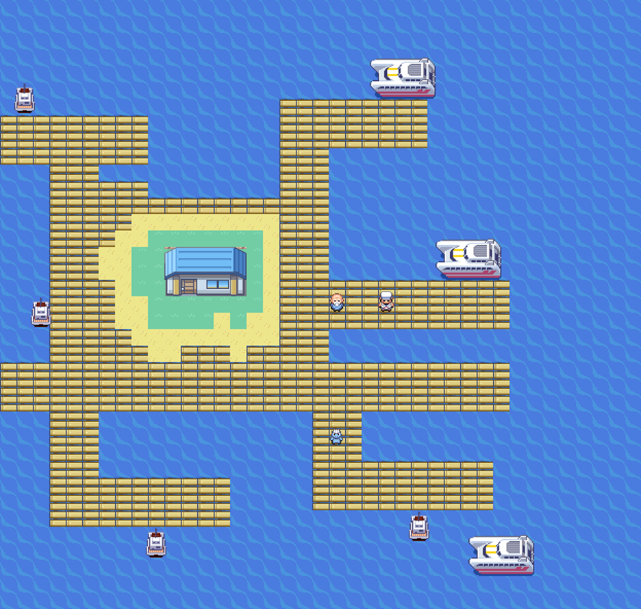
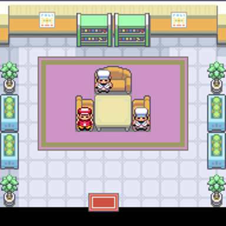
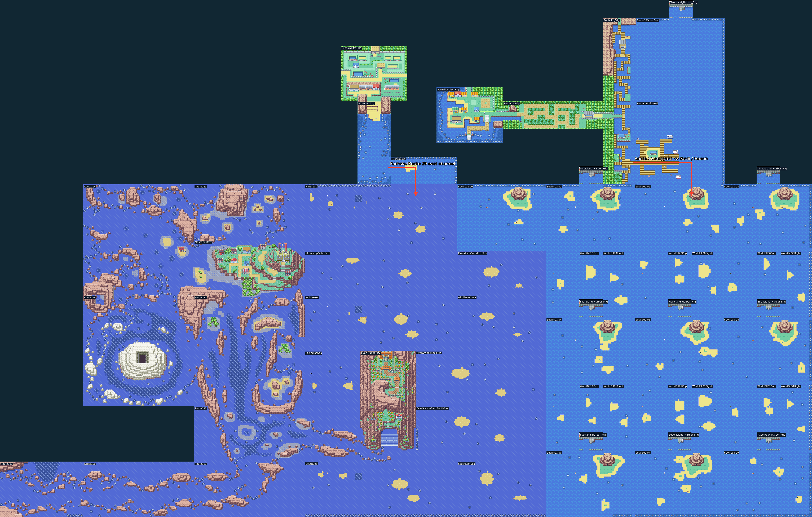

# Estaleiro da Rota 12

A ligação de Surf de Kanto para Sevii e Hoenn agora sai da costa leste da Rota 12, no ponto indicado pelo jogador. A antiga ligação de Vermilion foi retirada; a passagem de Fuchsia permanece.



As pontes originais desembocam num quadrado central de madeira menor, com braços de cais separados por água. A casa dos barqueiros tem um tile de grama ao redor de toda a fachada, seguido por um tile de areia em toda a volta. Sete barcos ficam encostados nos cais: quatro pequenos e três maiores. A massa de terra tem prolongamentos irregulares de grama e areia, limitados a dois tiles para oeste e para sul. A madeira envolve a faixa de areia, e os braços do cais se estendem para várias direções. Há também um braço a noroeste; os dois pequenos buracos de água no miolo da plataforma foram preenchidos com madeira. O barqueiro atende no braço ao lado da casa. O capitão mantém o serviço de barco para Slateport e Sevii. O nome provisório `ROUTE 12 YARD` foi substituído por **LAVENDER PORT** na [rede de barcos integrada](LAVENDER-PORT-NETWORK.md).



A casa usa a fachada completa da casa de pesca original e um salão com mesa, assentos, pescador e marinheiros. Todos os diálogos novos estão em inglês. Nenhuma missão, recompensa ou diálogo da casa de pesca original é alterado.



O mar superior e o estaleiro têm conexões de borda com a Rota 12. Ao sul, a passagem contínua segue pelo mar de Sevii até Hoenn, incluindo a costa atrás de Ever Grande. Two Island mantém seus mapas e eventos, com o porto ligado ao mar superior para evitar duas conexões sobrepostas. A porta do estabelecimento e as viagens de barco usam as transições normais do jogo; a travessia por Surf usa conexões contínuas entre mapas.

## Validação

Os relatórios em [route12-shipyard-validation](route12-shipyard-validation) registram a reprodução determinística da camada, a caminhada desde a ponte original, a travessia de ida e volta por Surf, a entrada e saída da casa, a viagem real de barco para Slateport e o retorno, incluindo salvar e continuar.

Os testes nativos usam uma equipe e posição inicial preparadas, encontros selvagens desativados e flags de treinadores derrotados para isolar colisões e transporte. Não representam uma conclusão das duas campanhas. As imagens são renderizadas dos metatiles e sprites reais; o panorama mostra a seção oriental integrada, não o mapa completo do PokéNav. Nenhuma ROM ou versão do jogador web é publicada neste PR.

## Reproduzir

Aplicar a camada `route12-port` sobre a fonte preparada até `ever-grande-entrance`:

```sh
python3 tools/hoenn/prepare_route12_port.py --source <fonte>
make -C <fonte> -j8
python3 tools/hoenn/verify_abilities.py --layer route12-port --source <fonte-anterior> --candidate <fonte> --output <reproducao>
python3 tools/hoenn/validate_route12_shipyard.py --source <fonte> --library <mgba-bridge.so> --output <viagem>
python3 tools/hoenn/validate_route12_ferry.py --source <fonte> --library <mgba-bridge.so> --output <barco>
python3 tools/hoenn/render_eastern_union.py --source <fonte> --output <galeria> --include-vermilion
```

Candidata compilada: `b01f85fc9f4544b7d3808018280683cf406e4359b97d2e644d3f4d7973df4504`.

O restante da ligação conserva as praias, cavernas externas, nadadores e treinadores dos mares já integrados. O estaleiro se conecta a essa rede pela borda sul, com Fuchsia preservada.

Validação concluída: 19 destinos na viagem contínua, 24 mudanças de mapa, entrada e saída nativas do salão, ida e volta real de barco e save/Continue. Passaram 257 testes de Hoenn e 12 de rotas marítimas. Uma segunda compilação normal produziu a mesma ROM.
