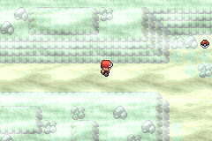
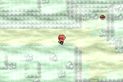

# Reencontro de Wanda sem Rock Smash

Candidata `407bd93bf4ee7e01878cdf3186a2a3a5b3d15f6954c8de6dcce942599ef9f3d9`.
As pedras de Rusturf Tunnel já tinham sido removidas para liberar a passagem.
O evento original, porém, dependia de quebrá-las: Wanda e o namorado nunca
se reencontravam e a recompensa Strength ficava inacessível.

Agora, depois do resgate de Peeko e quando o casal já estiver no túnel,
atravessar o trecho pelo oeste ou pelo leste inicia a cena original. Ambos
saem para a casa de Wanda em Verdanturf e você recebe **TM53 Strength**, um
ataque do tipo Rock. Não exige Rock Smash, insígnias ou movimentos na equipe.
A passagem permanece aberta antes da missão; o evento não conclui o resgate
nem faz aparecer o casal antes da apresentação original na Devon.

As três coordenadas originais continuam preparando a posição da cena. A do
meio fica no tile ocupado por Wanda; os dois acessos livres foram percorridos
no emulador. Esses gatilhos usam o modo imediato do motor: apenas agendam a
cena de quadro original, que pode esperar movimentos e diálogos normalmente.
O diálogo de agradecimento agora diz que o caminho está livre, sem afirmar
que o jogador quebrou uma pedra. Todo o texto do jogo continua em inglês.

## Verificação

O problema foi reproduzido na candidata anterior nos dois acessos livres.
Na nova candidata passaram a caminhada dos dois lados, a saída original do
casal, a entrega de uma TM, salvar/Continue e revisitar sem repetir a recompensa.
Antes do resgate, ou com o casal ainda oculto, a caminhada não conclui a cena.

A reprodução da camada é determinística e idempotente. O código das Ligas,
missões, níveis, encontros e família, além do mapa do túnel, permanece
preservado por SHA-256. A matriz de ginásios mantém os 43 cenários anteriores:
11.008 decisões e 44 permissões de eventos. As duas Ligas continuam exigindo
as 16 insígnias. [Relatórios](rusturf-reunion-validation).

Local inicial, equipe e resgate de Peeko são fixtures. Esse teste verifica o
reencontro por controle, não o resgate completo nem duas campanhas completas.
A candidata não foi publicada no player.

## Reprodução

Sobre a fonte de [SIXTEEN-BADGE-LEAGUES.md](SIXTEEN-BADGE-LEAGUES.md), aplique
`prepare_rusturf_reunion.py --source <fonte>` e compile com o toolchain do repo.
Confira a camada com `verify_abilities.py --source <fonte-anterior>
--candidate <fonte> --layer rusturf-reunion --output <pasta>`.
Execute `validate_rusturf_reunion.py --source <fonte> --library <mgba-bridge.so>
--output <pasta>`; a fonte anterior reproduz a falha. Rode também
`validate_campaign_matrix.py` e `audit_english_text.py` para as regressões.
