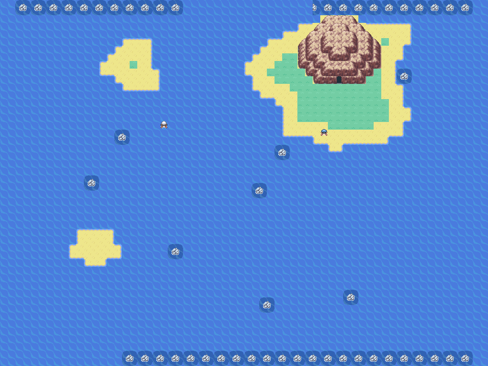
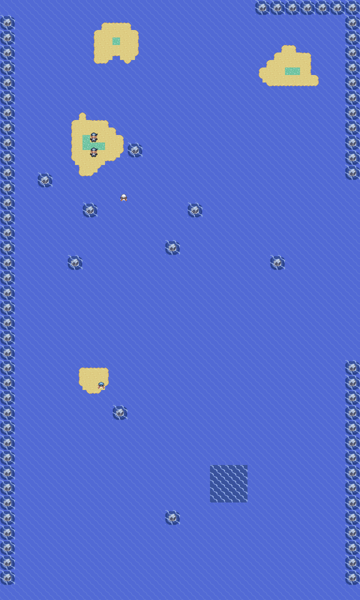

# Praias variadas e exterior nativo de Seafoam

Candidata compilada: `68bbf008a3dcf522824aad80a6b7ae3ca061a7b7f15a39f03192d99c27177f63`.
Camada `sea-landscapes`, aplicada após `rusturf-reunion`. Não atualiza o player.

Os 27 mapas marítimos ativos têm contornos diferentes, ilhotas assimétricas,
vegetação e rochedos completos. A água representa entre 67% e 88% dos blocos;
o restante inclui praias, montanhas e as barreiras visíveis das bordas.
As bordas sem conexão ficam fechadas com pedras aquáticas. Recifes no meio
da água mantêm distância das outras pedras, dos NPCs, portas e pontos Dive.

## Cavernas e pedras

O exterior copia **cada bloco da formação original da segunda entrada de
Seafoam na Rota 20**, cuja porta está em `(72,14)`. A cópia inclui topo,
paredes, contornos e porta. As praias ao redor variam. Os 14 interiores,
105 altares, flags, espécies e warps de retorno permanecem iguais à candidata
anterior, conforme solicitado. As posições das entradas continuam no documento
de localização dos Pokémon.

As pedras de Hoenn usam a formação aquática nativa completa, sem misturar
metades de rocha com tiles de penhasco. Os quatro quadrantes são posicionados
em relação à origem de cada rochedo, evitando inversões e peças truncadas.



## Rio e mar contínuos

São conexões nativas de borda: a câmera acompanha a passagem entre os trechos,
sem menus ou warps para viajar pelo mar.

- Cinnabar → CinnabarSouthSea → WestRiver.
- WestRiver → costa de Rustboro → costa de Dewford → Rota 105 → Rota 106 → praia de Dewford.
- A passagem RustboroGate liga a costa à Rota 115 e a Rustboro.
- O rio estreita na extremidade leste e desemboca no lago inferior da Rota 114.
  As linhas 4–9 do rio correspondem às linhas 14–19 da Rota 114, usando o
  deslocamento nativo `-10`; as duas margens estão alinhadas.
- A cachoeira original da Rota 114, em `(12,10..12)`, separa a parte alta.
  O penhasco original foi restaurado onde a abertura antiga permitia contornar
  a queda por água. Para subir pelo rio é necessário Waterfall; a descida
  segue o comportamento nativo.



## Treinadores e missões

Os 47 NPCs dos novos mares permanecem ligados aos mesmos scripts e IDs de
batalha; 22 ficam em terra e os outros na água. Um nadador existente por rota
larga foi reposicionado na areia, sem criar flags duplicadas. Os membros de
Aqua permanecem nas incursões da costa oeste. Os membros de Magma em Rock
Tunnel, as incursões de Pewter/Vermilion e a base Rocket de Hoenn ficam nos
seus mapas originais.

Equipes, níveis, missões, checkpoints dos ginásios, habitats e as regras das
duas Ligas não mudam. Os textos do jogo continuam em inglês.

## Validação e reprodução

Os resultados da compilação e da reprodução determinística estão em
[sea-landscapes-validation/preparation](sea-landscapes-validation/preparation).
As 96 travessias Surf de borda e as 11.008 decisões regionais de ginásio
passaram na candidata. A matriz também confere 44 permissões de chefes.
Também passaram os 47 NPCs visíveis sobre a superfície correta, Waterfall
com/sem o golpe, as 24 transições da viagem contínua com seis Continues e
os 14 acessos às cavernas, 105 altares e 33 Continues.
Os percursos executam os controles e colisões da ROM em mGBA. Viagem inicial, equipe e estados anteriores usam fixtures;
não constituem campanhas completas nem avaliação de dificuldade.

Cada emulador de teste usa um arquivo de ROM e de memória flash próprio,
para que testes paralelos de salvar/Continue não compartilhem saves.

```sh
python3 tools/hoenn/prepare_sea_landscapes.py --source <fonte-rusturf-reunion>
make -C <fonte-rusturf-reunion> -j4
python3 tools/hoenn/verify_abilities.py --source <fonte-anterior> --candidate <candidata> --layer sea-landscapes --output <resultados>
python3 tools/hoenn/render_sea_maps.py --source <candidata> --output <galeria>
python3 tools/hoenn/validate_sea_landscapes.py --source <candidata> --library <mgba-bridge.so> --output <resultados>
python3 tools/hoenn/validate_crossing.py --source <candidata> --library <mgba-bridge.so> --worldsea --westsea --east-coast --output <resultados>
python3 tools/hoenn/validate_sanctuary_routes.py --source <candidata> --library <mgba-bridge.so> --output <resultados>
python3 tools/hoenn/validate_ocean_journey.py --source <candidata> --library <mgba-bridge.so> --output <resultados>
```
