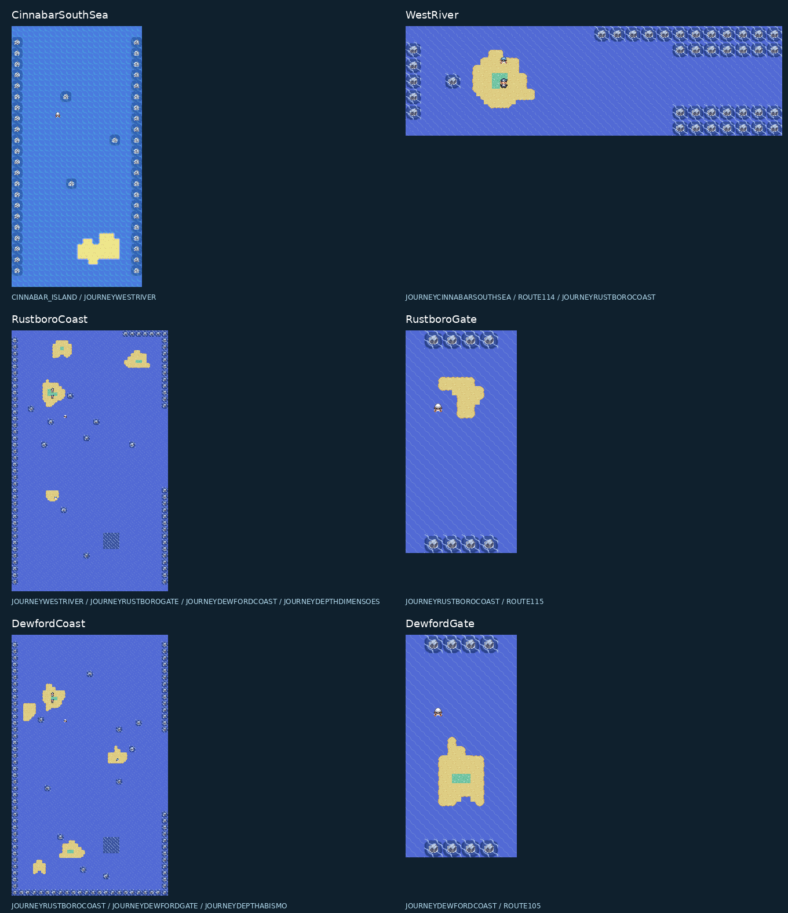
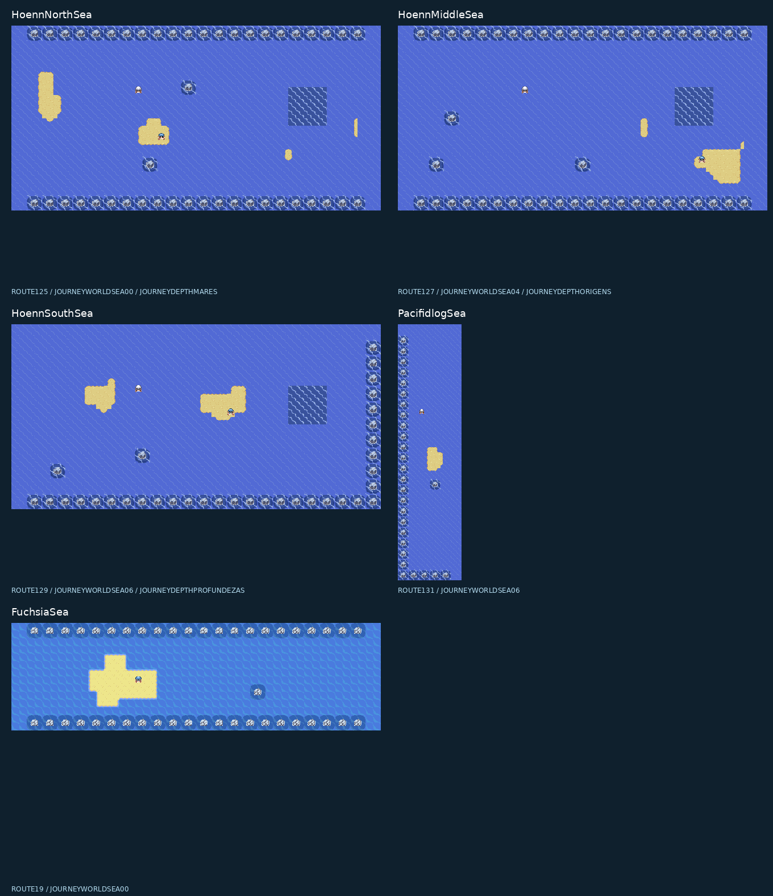
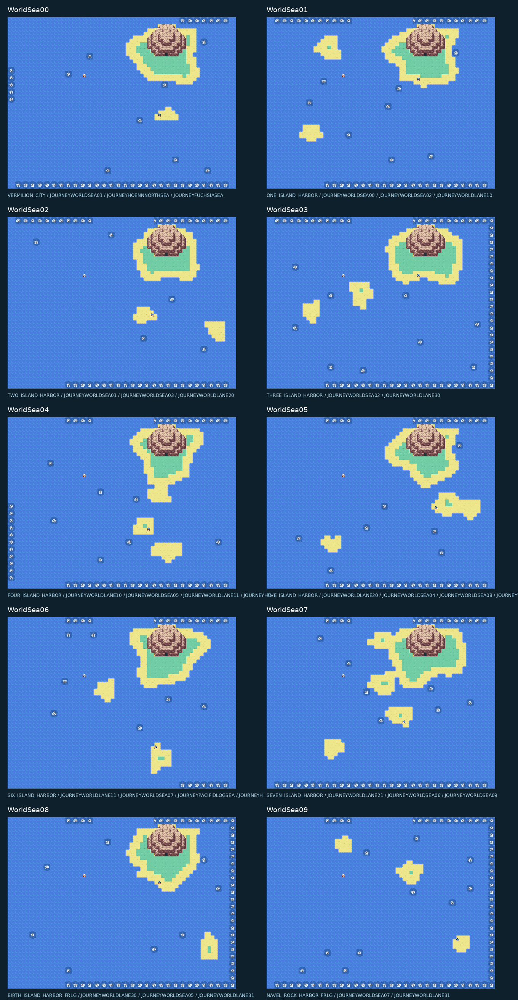
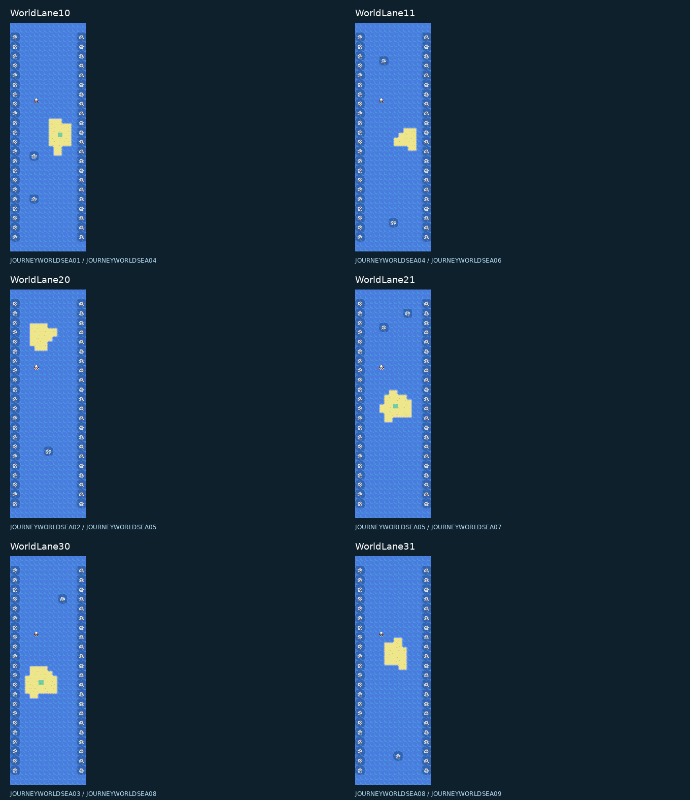

# Imagens das novas rotas marítimas

Esta galeria registra a camada `sea-landscapes`. O traçado leste atual está
na [união atrás de Ever Grande](EASTERN-SEA-UNION.md); a antiga saída da
Rota 131 foi substituída.

Imagens geradas diretamente dos mapas e tilesets da candidata
`68bbf008a3dcf522824aad80a6b7ae3ca061a7b7f15a39f03192d99c27177f63`.
A galeria inclui **27 mapas marítimos e 14 interiores existentes**, com sprites
reais dos NPCs e suas paletas nativas. Os objetos aparecem nas posições iniciais;
flags do save, animações e movimento não são simulados na exportação.
Capturas da ROM em mGBA ficam em [sea-landscapes-validation](sea-landscapes-validation).
As ligações mostradas vêm dos dados reais do jogo; a antiga
JourneyHoennCrossing está desativada e foi excluída.

A formação externa das cavernas é copiada integralmente da segunda entrada
de Seafoam, na Rota 20. As praias variam e os interiores foram preservados.
Os pedregulhos usam blocos completos; as bordas sem conexão ficam fechadas.
Veja [SEA-LANDSCAPES.md](SEA-LANDSCAPES.md).

## Cinnabar, rio da Rota 114, Rustboro e Dewford

Cinnabar liga ao novo mar ao sul; este chega ao rio da Rota 114, que continua
para a costa de Rustboro e, depois, para a costa de Dewford. As passagens
terrestres JourneyRustboroGate/JourneyDewfordGate desembarcam nas rotas
originais de Hoenn. O percurso completo anterior está em [OCEAN-JOURNEY.md](OCEAN-JOURNEY.md).

## Hoenn leste, Fuchsia e passagem para Pacifidlog

O mar norte liga a Rota 125 à área marítima de Vermilion; o mar intermediário
liga a Rota 127 a Sevii 4; o mar sul liga a Rota 129 a Sevii 6. A passagem
para Pacifidlog liga a Rota 131 ao mar de Sevii 6. Fuchsia liga a Rota 19
ao mar de Vermilion. Há saídas Dive nas áreas profundas indicadas no terreno.

## Mares de Vermilion e Sevii

WorldSea00 é o mar de Vermilion. WorldSea01–07 dão acesso aos portos das
ilhas 1–7. WorldSea08/09 completam a borda leste e conectam Navel Rock e
Birth Island. Os canais abaixo unem as linhas do conjunto.

As praias têm contornos distintos e o mar predomina. Nadadores aparecem na
água e na areia; os membros de Aqua estão nas ilhas da costa oeste.
Os interiores dos santuários e suas saídas permanecem como antes.

## Reprodução

`python3 tools/hoenn/render_sea_maps.py --source <fonte-compilada> --output <pasta>`

A galeria inclui PNGs individuais em resolução de 16 pixels por tile,
pranchas reduzidas com nearest-neighbor e [metadados](sea-map-gallery/maps.json)
com dimensões, conexões, SHA-256 de cada mapa/blocos e da ROM candidata.
