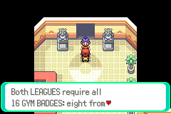
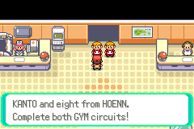

# As duas Ligas exigem as 16 insígnias

Candidata `19a4cd8a7253e829d77c1a104fe17ff1722e407ddf7c6605f33a2a23d7e3d4f4`.
A entrada da Elite Four de Kanto e a de Hoenn exigem oito insígnias de cada
região. As Ligas e os campeões continuam separados. Os guardas explicam essa
exigência em inglês; não dizem que um líder de ginásio está ocupado.

As missões permanecem obrigatórias **nos ginásios ainda não vencidos**, nos
checkpoints regionais já combinados. Não foram transferidas para a Liga.
O guia do ginásio indica a equipe, a missão e o local. Rotas e níveis dos
trainers não foram alterados nesta correção.

| Região / insígnias obtidas | Missões antes do próximo ginásio |
|---|---|
| Kanto / 1 | Mt. Moon: quatro Rockets, Miguel e escolha do fóssil |
| Kanto / 2 | Esconderijo Rocket de Celadon; Rocket de Cerulean e recrutador da Rota 24 |
| Kanto / 4 | Magma em Pewter/Rock Tunnel; Aqua em Vermilion/corredor aquático oeste; incursões nas rotas 3/6/8/15; Marowak, três Rockets e resgate de Fuji |
| Kanto / 6 | Giovanni na Silph Co.; bloqueia os dois últimos ginásios |
| Hoenn / 1 | Petalburg Woods e recuperação Devon/Peeko em Rusturf |
| Hoenn / 2 | Maxie no Mt. Chimney; carta a Steven; Museu de Slateport |
| Hoenn / 4 | Base Rocket sob o cassino de Mauville e Shelly no Instituto Meteorológico |
| Hoenn / 5 | Maxie no Magma Hideout, preservando Mt. Pyre/Magma Emblem |
| Hoenn / 6 | Matt no esconderijo Aqua, preservando o roubo do submarino |
| Hoenn / 7 | Centro Espacial contra Maxie/Tabitha com Steven; Archie/Shelly com Giovanni; Rayquaza encerrando a crise |

Giovanni continua obrigatório no confronto final de Hoenn: é necessário
concluir a Silph Co. após seis insígnias de Kanto. Viridian é um ginásio comum
com Blue, não uma missão Rocket. As quantidades acima são de cada região,
independentemente da ordem escolhida para enfrentar os líderes.

## Mensagem e testes

Na candidata anterior, oito insígnias de uma região e sete da outra permitiam
entrar na Liga daquela região. Essa regra foi reproduzida no ARM e corrigida.
Na nova candidata passaram 2.048 permissões, oito casos físicos de bloqueio,
salvar/carregar e liberação após obter as 16 insígnias. Uma flag antiga de
entrada na Elite Four não dispensa a exigência. A posição dos guardas de Hoenn
é restaurada quando um acesso anteriormente negado passa a ser permitido.

Os 43 cenários das missões mantêm exatamente os resultados anteriores:
11.008 decisões de ginásio e 44 permissões de eventos. O código de campanha
fora das duas permissões de Liga e os scripts de Silph/Centro Espacial/Archie,
família, níveis dos ginásios e encontros estão preservados por SHA-256.
[Relatórios](sixteen-badge-league-validation).

Insígnias, progresso inicial, equipe e warps são fixtures. Os testes não
representam duas campanhas completas jogadas. A candidata não foi publicada
no player e não constitui migração validada de saves antigos.

## Reprodução

Sobre a fonte da etapa [MANDATORY-NATIVE-MISSIONS.md](MANDATORY-NATIVE-MISSIONS.md),
aplique `tools/hoenn/prepare_sixteen_badge_leagues.py --source <fonte>` e compile.
Use `verify_abilities.py --source <fonte-anterior> --candidate <fonte> --layer sixteen-badge-leagues
--output <relatório>` para conferir reprodução e idempotência.
Execute `validate_sixteen_badge_leagues.py --source <fonte> --lib <mgba-bridge.so>
--output <pasta>` e `validate_campaign_matrix.py` com os mesmos argumentos.
A revisão inglesa usa `audit_english_text.py --candidate <fonte> --output <arquivo>`.
Os scripts verificam o commit fixado e as camadas anteriores antes de editar.
