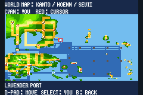
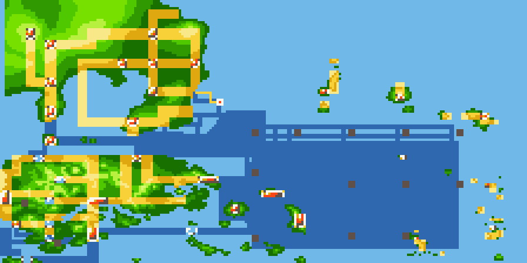

# Mapa do mundo integrado

Abra **Start → MAP** no jogo. A mesma tela integrada é usada pelo Town Map e pelo mapa do Pokénav. Os nomes e controles dentro do jogo estão em inglês.

O mar usa uma cor azul uniforme; as rotas aquáticas navegáveis são azul escuro. As marcações não cobrem o terreno das ilhas nem as cidades. O mapa inclui Lavender Port, as novas costas e passagens marítimas, as Sevii e os santuários. O mar azul escuro entre Fuchsia, Lavender e o oceano leste representa agora uma área contínua de Surf. A ligação amarela ao norte do cais corresponde à ponte a pé.

As linhas indicam conexões existentes nos mapas do jogo; o mapa regional não representa cada pedra ou cada tile de praia.

O antigo botão amarelo de troca de região, com o centro branco, foi removido somente da arte do mapa integrado. O terreno das ilhas ao redor permanece preservado.

O indicador ciano é a posição do jogador e o cursor vermelho permite consultar lugares. Use as setas para mover, **Select** para voltar à sua posição e **B** para retornar. O sistema original de Fly permanece preservado.

A validação nativa abre MAP com controles reais em Kanto, Hoenn, Sevii e Lavender Port, move e recentraliza o cursor e retorna sem alterar a posição do jogador. Viagem e configuração inicial desses cenários são fixtures; esse teste não equivale a concluir as campanhas.
